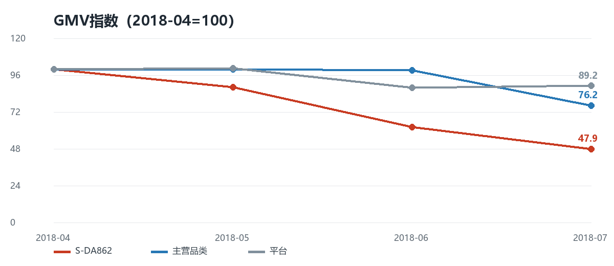
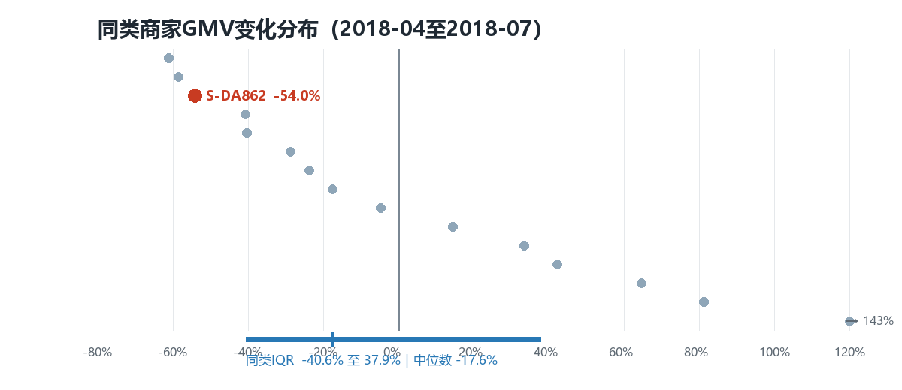
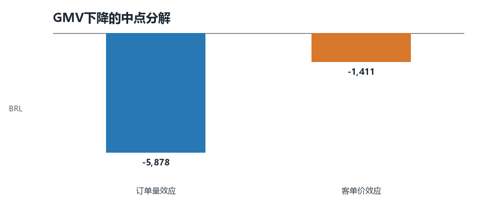

# Business Analytics Portfolio

## Project Overview

An end-to-end business analytics portfolio for e-commerce merchant performance. The repository contains three independently deployable Streamlit applications, plus the supporting SQL, Notebook, standardized analysis outputs, resume, and executive summaries.

## Business Background

The portfolio focuses on diagnosing sustained merchant GMV decline. It connects business understanding, KPI definition, SQL data extraction, Python analysis, merchant anomaly identification, and decision-support reporting in one reproducible workflow.

## Portfolio Structure

```text
Business-Analytics-Portfolio/
├── dashboard/                 # Business dashboard Streamlit entry
├── anomaly_detection/         # Anomaly detection Streamlit entry
├── weekly_report/             # Weekly report Streamlit entry
├── executive/                 # Business and product executive summaries
├── resume/                    # Business and product resumes
├── assets/screenshots/        # Application screenshots / placeholders
├── shared/                    # Shared KPI, chart, anomaly, and reporting logic
├── data/                      # Deployment-ready data files
├── analysis/                  # SQL, Notebook, figures, and analysis outputs
├── requirements.txt
└── .gitignore
```

## Dashboard

Interactive KPI monitoring and merchant diagnosis for GMV, orders, AOV, active merchants, contribution structure, peer comparisons, and SKU-level operating signals.

## Anomaly Detection

Configurable merchant anomaly screening based on GMV, order volume, delivery delays, and review-quality signals. Results include severity, evidence, investigation direction, and recommended next action.

## Weekly Business Report

An executive-ready reporting workflow that turns selected operating data into a management summary, KPI review, risk signals, action suggestions, and downloadable Word report.

## Tech Stack

Python · Streamlit · Pandas · NumPy · DuckDB · Plotly · python-docx · SQL · Jupyter Notebook

## How to Run

```bash
python -m venv .venv
python -m pip install -r requirements.txt

streamlit run dashboard/app.py
streamlit run anomaly_detection/app.py
streamlit run weekly_report/app.py
```

## Deployment

Create three Streamlit Community Cloud applications from this repository and select one entry file per deployment:

- `dashboard/app.py`
- `anomaly_detection/app.py`
- `weekly_report/app.py`

All runtime paths resolve from the repository root. The deployment data is included under `data/`; the raw source archive is intentionally excluded.

## Screenshots

| Dashboard | Anomaly Detection | Weekly Report |
| --- | --- | --- |
|  |  |  |

## Resume and Executive Summary

- `resume/Resume_Business_Final.docx`
- `resume/Resume_Product_Final.docx`
- `executive/Executive_Business_Final.docx`
- `executive/Executive_Product_Final.docx`

## Contact

梁笑涵 · 13080622230@163.com
